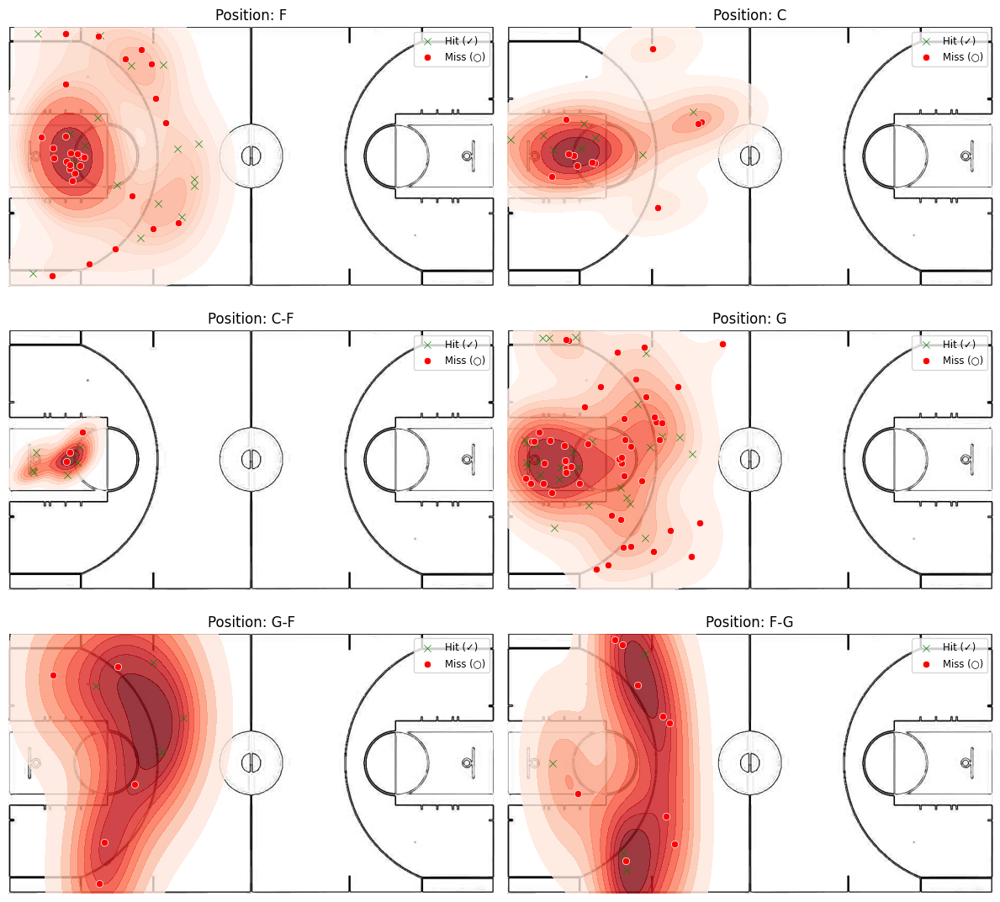
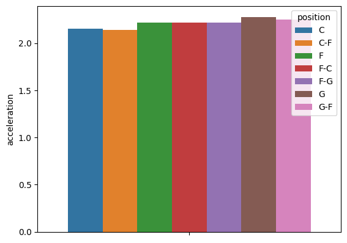
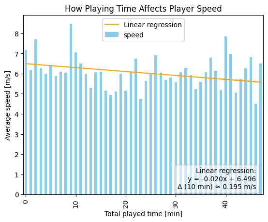

# 🏀 NBA Player Spatial Movement Analysis

This repository contains my personal analysis of NBA player movement data using **GeoPandas** and **Moveing Pandas**. The project explores spatial patterns, trajectories, and positional trends of players during games.

## 📌 Project Overview

The goal of this project is to analyze the **spatial movement of NBA players** across different games using two datasets containing tracking data. The project focuses on understanding player behavior and movement across the court through data preprocessing, spatial operations, and visualization.

### 🧠 Key Features
- Spatial analysis using `geopandas` and `movingpandas`
- Data cleaning and fixing invalid geometries
- Merging and aligning **two incompatible datasets**
- Extraction and analysis of player trajectories
- Visualization of player movement patterns

---

## ⚠️ Challenges Encountered

- The two spatial datasets had **incompatible coordinate systems and formats**
- Many geometries were **corrupted or invalid**, requiring manual correction and validation
- Merging positional and metadata required resolving mismatched keys and missing data

Dataset and gifs genarator comes from https://github.com/linouk23/NBA-Player-Movements
